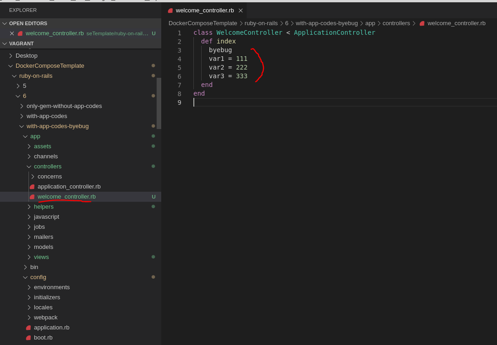
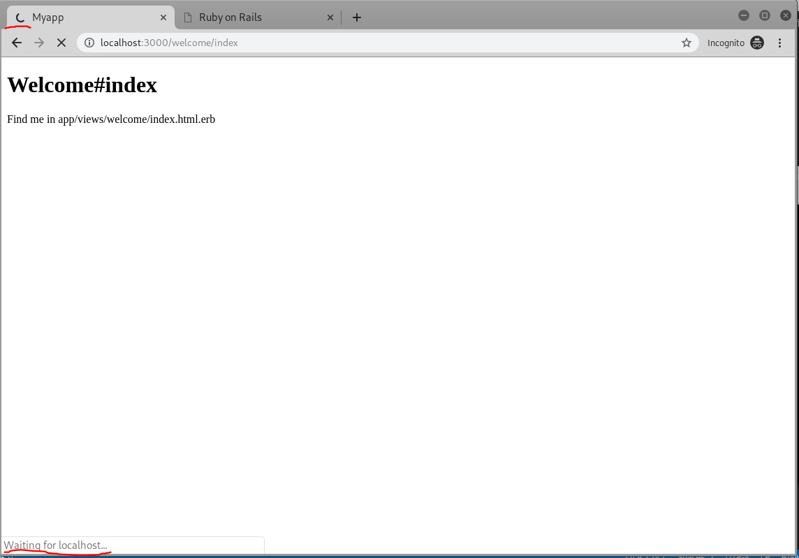
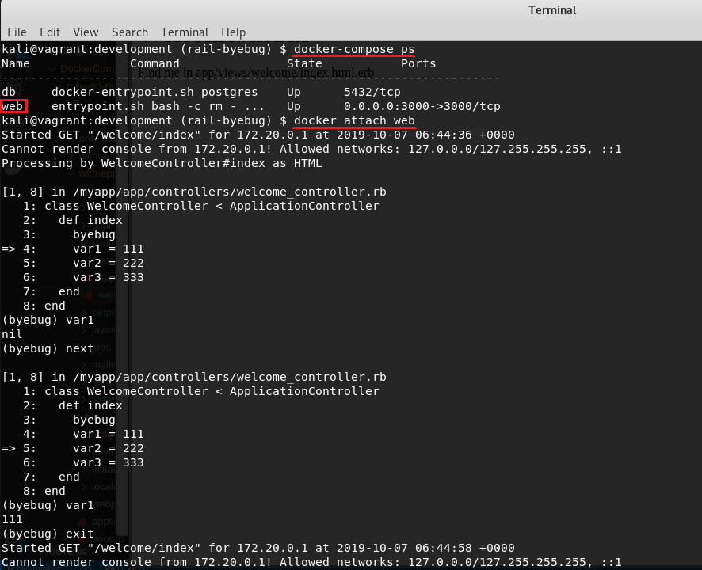
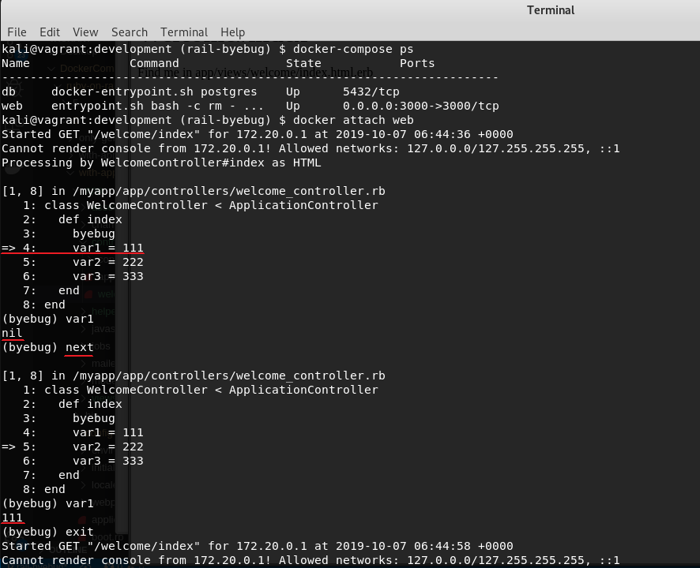
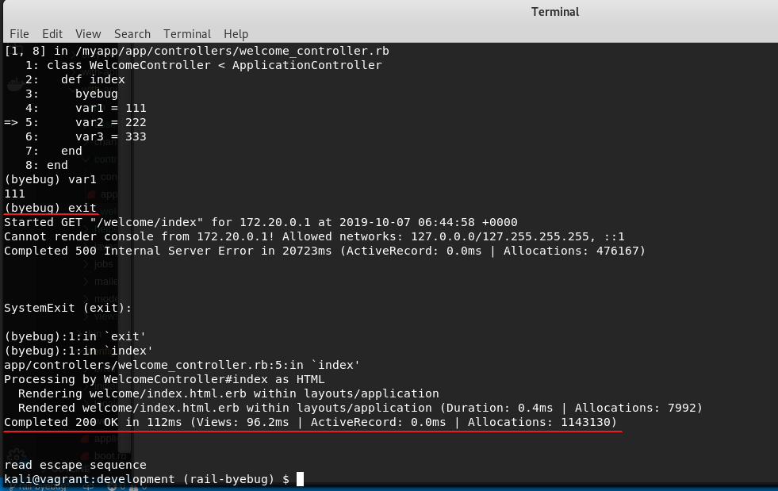
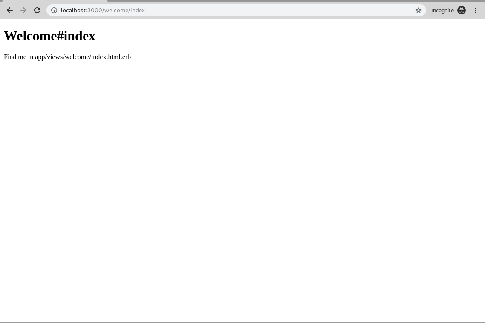

# ruby-on-rails6-with-app-codes-byebug
- Docker Composeで建てたrails6のbyebug使用方法の説明です

## 重要なことは
- dockerのattachを活用
  - このためdocker-compose.ymlに `stdin_open: true` と `tty: true` を追加する必要がある
  - byebugをちゃんとexitした後に、 `Ctrl+P` と `Ctrl+Q` でdocker attachから抜ける必要がある
    - 順番間違ったらrailsの挙動が怪しくなる

## 実行するコマンド
### docker-compose.ymlのところに移動
- `cd server/docker/development/`

### volumesの権限調整(linux上でDocker Composeを動かす場合必要)
権限調整に必要なlinuxのuser id、group id、user nameを.envに書く
- `sh setDotEnv.sh`

### DB生成(DB生成しなかったら実行)
- `docker-compose run web rake db:create`

### バックグラウンドでrailsとDBを動かす
- `docker-compose up -d --build`

### byebug使用例に直接関わる部分
#### byebug使用例のためにcontrollerを作成
- `docker exec web rails generate controller Welcome index`

#### 作成されたcontrollerの所有者がrootになるため、権限調整(自動化は今後する)
- `sudo chown -R $(id -u $USER):$(id -g $USER) ../../../`

#### WelcomeControllerのコードにbyebugを試しに書く
- `docker exec web rails generate controller Welcome index`

#### WelcomeControllerにbyebugがかかったことを確認
プログラムの実行が止められたから、ブラウザーがずっとぐるぐるする

#### attachするdockerコンテナ名前確認後、docker attach実行
- `docker attach web`

#### byebugが動くか確認する
- `var1`
- `next`
- `var1`

#### debugが終わったら、byebugを終了する
- コードから `byebug` を消す
- コンソールに `exit` を入力してエンター
- `200 OK` 出た後に(下のイメージ参考)、コンソールに `Ctrl+P` と `Ctrl+Q` を押す

#### byebugがちゃんと終了したことをブラウザー上で確認

